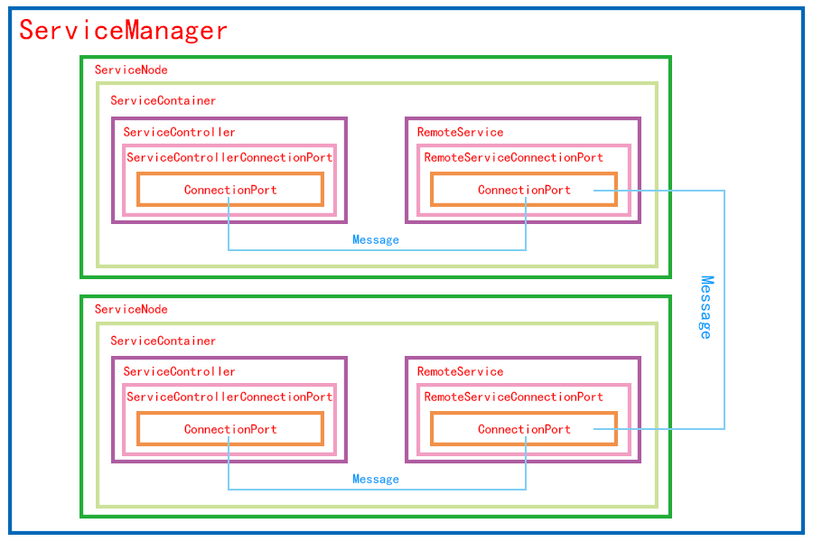

# services-cluster
这是一个抽象对于创建集群化JavaScript应用程序。
该库抽象了一些创建集群化应用的关键部分，但并没有抽象化消息传递以及消息路由，
这样做是为了尽可能地提供灵活性，使它可以应用在更多地方。

## 结构图
;

## 标准规范介绍

### 服务管理器(ServicesManager)
管理服务节点的创建与销毁

#### 功能
* 管理所有`服务容器`的`创建(create)`、`启动(start)`、`关闭(close)`、`销毁(destroy)`
* 检查服务名称是否合规
* 确保所有服务的服务名唯一
* 确保服务`创建(create)`、`销毁(destroy)`顺序

#### 规定
* 创建顺序：如果A服务依赖B服务，则B服务应当在A服务之前被创建。
* 销毁顺序：如果A服务依赖B服务，则A服务应当在B服务之前被销毁。
* 父子关系：如果A服务是在B服务中创建的，则A服务应当在B服务之前被销毁。

### 服务节点(ServiceNode)
对一个服务容器的简单封装。用于控制容器与容器之间的启动和关闭顺序。

#### 功能
* 监控对应`服务容器`的运行状态变化，根据`服务容器`运行状态的变化来执行启动关闭服务的策略。`服务容器`的运行状态包括
    * `正在启动(starting)`
    * `正在运行(running)`
    * `正在关闭(closing)`
    * `已关闭(closed)`
* 确定服务容器之间的启动顺序与关闭顺序

#### 规定
* 启动顺序：如果A服务依赖B服务，则B服务应当在A服务之前启动。
* 关闭顺序：如果A服务依赖B服务，则A服务应当在B服务之前关闭。
* 服务崩溃关闭顺序：当C依赖A，A依赖B，如果B崩溃，则先关闭C再关闭A。
* 父子关系：如果A服务是在B服务中创建的，则A会被强制要求依赖B提供的服务。也就是说子会在父关闭之前被关闭。
* 服务可获取性：只有当服务完全启动后，其他服务才能获取该服务，也就是说，如果A要获取B的服务，则A必须等到B完全启动之后才能被启动。

### 服务容器(ServiceContainer)
一个服务运行的环境。一个服务容器是有两部分构成的，`服务控制器(ServiceController)`与`远程服务(RemoteService)`。
`远程服务(RemoteService)`在远端运行。

#### 功能
* 创建服务执行环境（例如创建一个新的进程或docker容器等等）
* `设置`服务的执行权限
    * 文件读写
    * 依赖的其他服务的名称
    * 开启子服务
    * 访问网络
    * 等等...
* 控制容器内部服务的`启动(start)`、`关闭(close)`
* 监控`远端服务`的运行状态包括
    * `正在启动(starting)`
    * `正在运行(running)`
    * `正在关闭(closing)`
    * `已关闭(closed)`
* 设置服务运行的代码字符串
* 监控网络连接，如果与远程服务断开连接，则远程服务会被直接关闭。

#### 规定
* 每`启动(start)`一次就有一个新的`服务控制器(ServiceController)`和`远程服务(RemoteService)`被创建。
* 一旦`关闭(close)`服务，对应的`服务控制器(ServiceController)`和`远程服务(RemoteService)`就会被销毁。
* 一个服务容器中只能运行一个服务

### 服务控制器(ServiceController)
用于控制一个远程的服务。

#### 功能
* 通知远端服务准备`关闭(close)`
* 监控网络连接
* 监控`远端服务`的运行状态包括
    * `正在启动(starting)`
    * `正在运行(running)`
    * `正在关闭(closing)`
    * `已关闭(closed)`
* 记录服务运行期间所有未捕获的异常信息。
* 记录服务运行期间的标准输出(stdout)、标准错误输出(stderr)。
* 服务的资源消耗情况（如cpu与内存）
* 当远端准备完毕后发送服务代码给远端服务执行

#### 规定
* ServiceController与RemoteService之间传递的消息只能通过事件，使用特定类型来标记。
* ServiceController无法访问RemoteService提供的服务和事件消息。

### 远端服务(RemoteService)
用于处理对应控制器或其他远程服务发送过来的请求和事件。

#### 功能
* 准备好了之后向控制端发送一个remoteReady事件
* 执行服务控制器发过来的服务代码
* 处理服务控制器发来的事件消息
* 收集未捕获的异常信息，并发送给服务控制器
* 收集资源消耗情况（如cpu与内存），并发送给服务控制器
* 记录服务运行期间的标准输出(stdout)、标准错误输出(stderr)，并发送给服务控制器
* 通知服务控制器服务运行状态的变化
* 处理来自其他服务发来的请求
* 发送请求
* 接受事件
* 发送事件

### 通信连接端口(ConnectionPort)
统一收发消息接口的样式。

